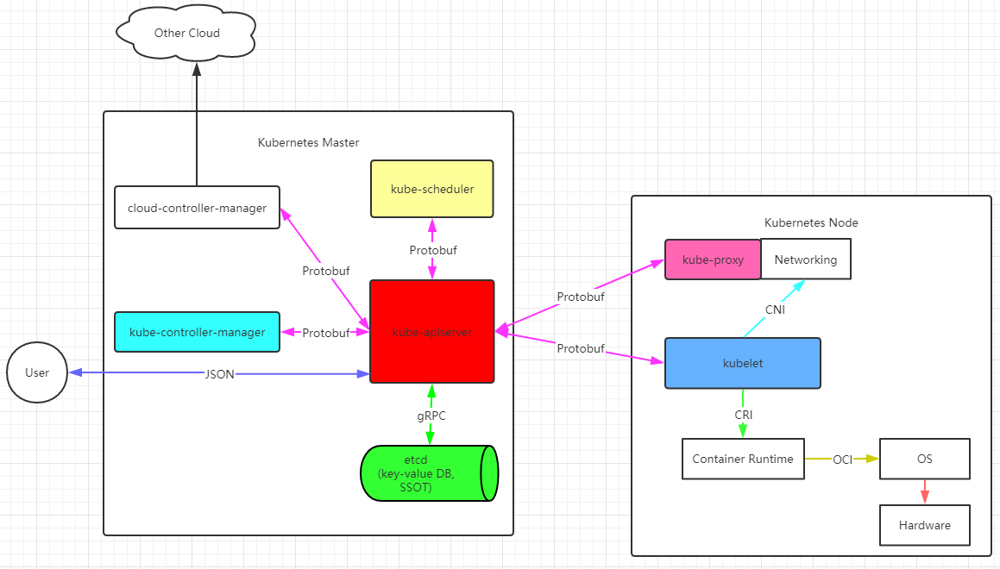

## 1.Kubernetes Components
 - 
## 2.[Control Plane Components](https://kubernetes.io/docs/concepts/overview/components/#control-plane-components)
 - kube-apiserver
   - 控制平面的暴露出来的API服务, 是用户访问的入口, 也是k8s前端
   - 无状态应用, 可以运行多个实例分摊负载
 - etcd
   - 高可用的kv存储, 作为kubernetes数据存储于协调组件
   - [备份方案](https://kubernetes.io/docs/tasks/administer-cluster/configure-upgrade-etcd/#backing-up-an-etcd-cluster)
   - [官方文档](https://etcd.io/)
 - kube-scheduler
   - 负责pod调度
   - watch apiserver的资源变动, 并根据策略(算法)调度kublet来创建pod
 - kube-controller-manager
   - 负责pod编排
   - 独立的二进制进程, 包括
     - Node Controller
       - Responsible for noticing and responding when nodes go down.
       - 负责节点宕机时的通知和响应
     - Replication Controller
       - Responsible for maintaining the correct number of pods for every replication controller object in the system.
       - 负责维护系统中每个pod的数量正确
     - Endpoints Controller
       - Populates the Endpoints object (that is, joins Services & Pods)
       - 
     - Service Account & Token Controllers
       - Create default accounts and API access tokens for new namespaces.
 - cloud-controller-manager
   - 暂时不懂
## 3.[Node Components](https://kubernetes.io/docs/concepts/overview/components/#node-components)
 - kublet
   - kublet 主要负责和容器运行时打交道, 这个交互依赖CRI(Container Runtime Interface)的远程调用接口, 这个接口定义了容器运行的各项核心操作, 具体运行时通过OCI这个容器运行时规范同底层Linux操作系统交互, 即：把 CRI 请求翻译成对 Linux 操作系统的调用（操作 Linux Namespace 和 Cgroups 等.
   - kublet 可以调用网络插件CNI(Container Networking Interface)和存储插件CSI(Container Storage Interface)为容器配置网络和持久化存储.
   - kublet 还通过gRPC插件协同 Device Plugin交互. 这个插件是管理GPU等宿主机物理设备的组件.
 - kube-proxy
   - node上的网络代理组件
 - Container Runtime
   - 容器的运行时, 支持
     - Docker
     - containerd
     - cri-o
     - rktlet
## 4.[Addons](https://kubernetes.io/docs/concepts/overview/components/#addons)
 - DNS
 - Web UI (Dashboard)
 - Container Resource Monitoring
 - Cluster-level Logging 