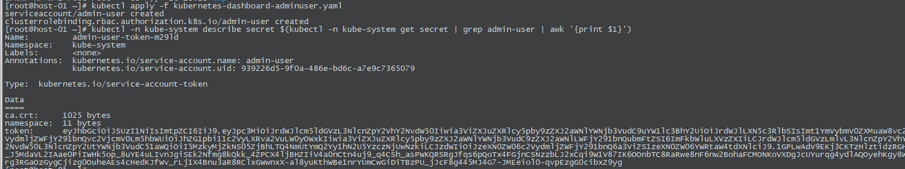
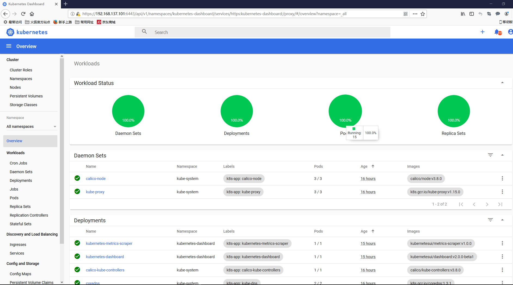

# kubernetes dashboard 安装
## 1. kubernetes [dashboard install](https://github.com/kubernetes/dashboard/wiki/Installation#recommended-setup) 
 - [官网教程](https://kubernetes.io/docs/tasks/access-application-cluster/web-ui-dashboard/#deploying-the-dashboard-ui)
 - [github](https://github.com/kubernetes/dashboard)
 - [wiki](https://github.com/kubernetes/dashboard/wiki)
 
```bash
curl -O https://raw.githubusercontent.com/kubernetes/dashboard/v2.0.0-beta4/aio/deploy/recommended.yaml
mv recommended.yaml kubernetes-dashboard.yaml
kubectl apply -f kubernetes-dashboard.yaml
```
## 2. 添加用户
 - [Creating-sample-user](https://github.com/kubernetes/dashboard/wiki/Creating-sample-user)
 
 创建用户配置文件 kubernetes-dashboard-adminuser.yaml
 ```yaml
apiVersion: v1
kind: ServiceAccount
metadata:
  name: admin-user
  namespace: kube-system

---

apiVersion: rbac.authorization.k8s.io/v1
kind: ClusterRoleBinding
metadata:
  name: admin-user
roleRef:
  apiGroup: rbac.authorization.k8s.io
  kind: ClusterRole
  name: cluster-admin
subjects:
  - kind: ServiceAccount
    name: admin-user
    namespace: kube-system
```
kubectl apply -f kubernetes-dashboard-adminuser.yaml

## 3. 生成token
 - 生成token
 ```bash
 kubectl -n kube-system describe secret $(kubectl -n kube-system get secret | grep admin-user | awk '{print $1}')
 ```
 - 
 
## 4. 生成SSL证书 & 添加到浏览器(适用 api server 方式访问)
 - 生成SSL证书
 ```bash
 # 生成client-certificate-data
 grep 'client-certificate-data' ~/.kube/config | head -n 1 | awk '{print $2}' | base64 -d >> kubecfg.crt
 # 生成client-key-data
 grep 'client-key-data' ~/.kube/config | head -n 1 | awk '{print $2}' | base64 -d >> kubecfg.key
 # 生成p12
 openssl pkcs12 -export -clcerts -inkey kubecfg.key -in kubecfg.crt -out kubecfg.p12 -name "kubernetes-client"
 ```
 - kubecfg.p12 证书添加到浏览器, 个人
 - 访问: https://192.168.137.101:6443/api/v1/namespaces/kubernetes-dashboard/services/https:kubernetes-dashboard:/proxy/
 - 使用token登录(第3步生成的token)
 - 
 
    